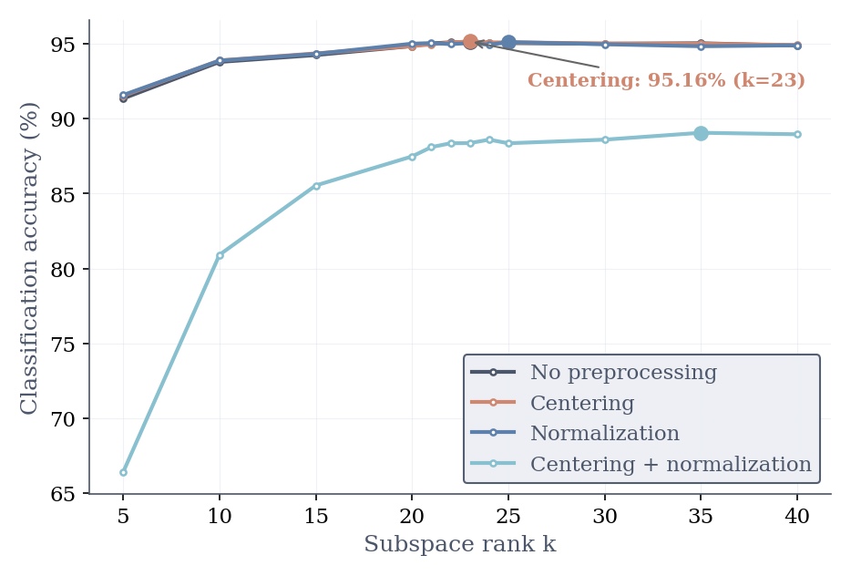
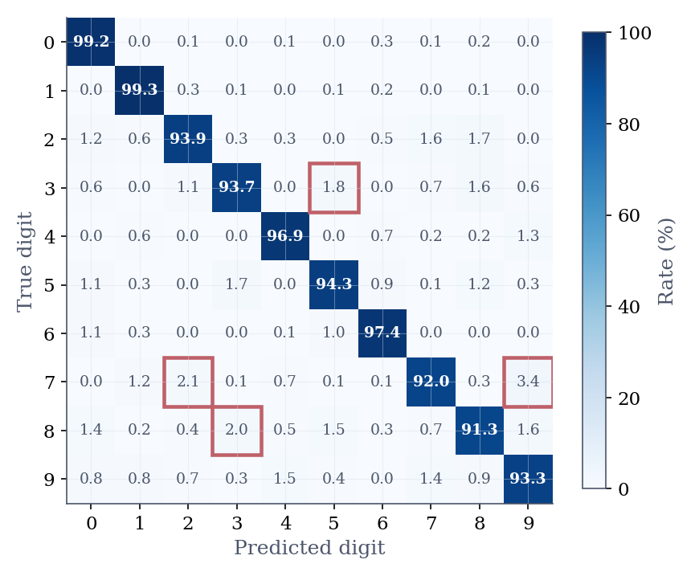

# Digit Classification on MNIST Using SVD

This project studies an SVD-based handwritten digit classifier on the MNIST dataset and how the subspace dimension $k$ affects classification performance. Each digit class is represented by a low-rank subspace, and a test image is assigned to the class with the smallest reconstruction residual.

## 1. Problem

The task is multiclass classification on the MNIST handwritten digit dataset. The goal is to decide, for each test image, which digit in $\{0,\dots,9\}$ it represents.

A classification task can be decomposed into three parts:

- Representation: how to represent the training images of each digit class  
- Measure: how to compare a test image with each class representation  
- Evaluation: how to judge whether the classifier is performing well  

In this project, we study an SVD-based classifier.

SVD is used to represent each digit class by a low-dimensional linear subspace. This assumes that images from the same class share a common structure that can be captured by a small number of basis directions.

Under this assumption, if a test image belongs to a given class, it should be well approximated by the corresponding class subspace. Therefore, classification can be performed by projecting the test image onto each class subspace and measuring the reconstruction residual.

The class with the smallest residual is selected.

Classification performance is evaluated using accuracy. Since MNIST is a balanced dataset, accuracy is an appropriate primary metric.

The main variables in this project are the subspace dimension $k$, which controls how much structure is retained in each class representation, and the preprocessing applied before constructing the class subspaces.

## 2. Method

We now formalize the SVD-based classifier described above.

For each digit class $i \in \{0, \dots, 9\}$, form a training matrix $X_i \in \mathbb{R}^{784 \times n_i}$ whose columns are the training images from class $i$. Compute its singular value decomposition:

$$
X_i = U_i \Sigma_i V_i^T
$$

Let $U_{k,i}$ denote the first $k$ columns of $U_i$. For a test image $d \in \mathbb{R}^{784}$, project $d$ onto the class-$i$ subspace and measure the reconstruction residual:

$$
r_i(d) = \left\| d - U_{k,i} U_{k,i}^T d \right\|_2
$$

Then predict the class with the smallest residual:

$$
\hat{y}(d) = \arg\min_i r_i(d)
$$

## 3. Experimental Setup

The experiments are designed to evaluate how the choice of subspace dimension $k$ and preprocessing affect classification performance.

- Dataset: MNIST, using the standard split (60,000 training images and 10,000 test images)

- Training subset: for each digit class, the first 400 training samples are used to construct the class subspace

- Preprocessing: four settings are considered:
  - No preprocessing
  - Centering (subtracting the class mean)
  - Normalization (unit Euclidean norm)
  - Centering followed by normalization

- Rank values: $k \in \{5, 10, 15, 20, 21, 22, 23, 24, 25, 30, 35, 40\}$

- Evaluation metric: classification accuracy on the full MNIST test set

## 4. Results

The main outputs are the accuracy-versus-$k$ curve and the confusion matrix at the best tested setting. In the current run, the best overall setting is centering with $k = 23$, which achieves $95.16\%$ test accuracy.

<div align="center">


**Figure 1.** Classification accuracy as a function of subspace dimension $k$ across the four preprocessing settings.
</div>

The three better-performing settings, no preprocessing, centering, and normalization, all reach about $95\%$ accuracy and show very similar performance trends. Centering gives the best peak result at $k=23$, while normalization is close behind at $k=25$ with $95.12\%$. In contrast, centering followed by normalization performs substantially worse, reaching a maximum accuracy of $89.06\%$ at $k=35$, after which the curve is nearly flat.


<div align="center">


**Figure 2.** Normalized confusion matrix at the best tested rank.
</div>

## 5. Discussion

The results show a clear effect of the subspace dimension $k$. Small values underfit because the class subspaces are too limited to capture the main variation of each digit, while larger values improve accuracy until the performance levels off around $k=23$ to $25$.

The effect of preprocessing is mixed. Centering and normalization give slight improvements over the no-preprocessing baseline, whereas centering followed by normalization substantially reduces accuracy. This indicates that some preprocessing choices are compatible with the SVD classifier, while others weaken the class representation.

The confusion matrix shows that most remaining errors are concentrated in a few digit pairs rather than spread uniformly across all classes. This suggests that the classifier works well overall, and that the main difficulty lies in distinguishing a small number of visually similar digits.

## Reproducibility

Create and activate an environment with Python 3.10 or later:

```bash
conda create -n mnist-svd python=3.10
conda activate mnist-svd
pip install -e .
```

Prepare the MNIST arrays:

```bash
python src/data_preparation.py
```

Run the classifier experiment:

```bash
python src/classifier.py
```

This writes the plots to `figures/` and stores the best predictions in `data/BestPredictions.npy`.
